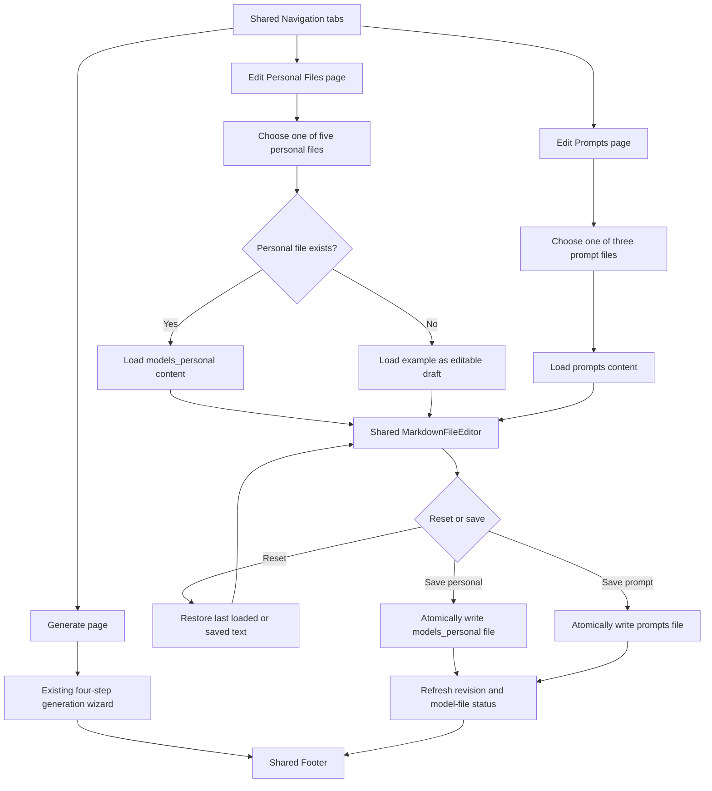
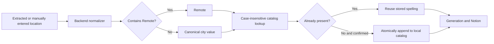

# Resume Friend — Input Markdown Editor and Location Normalization Plan

## Plan status

- Status: proposed; implementation has not started
- Prepared: 2026-08-06
- Product reference: `plans/Resume Friend - Flowchart for Input MD Editor.png`
- Scope: add two Markdown editor pages, a shared tabbed application shell, and normalized job locations backed by a persistent local catalog

## Outcome

Resume Friend will have exactly three top-level pages:

1. **Generate** — the existing resume-generation wizard.
2. **Edit Personal Files** — edits the five private applicant Markdown files.
3. **Edit Prompts** — edits the three public application-prompt Markdown files.

A reusable header `Navigation` component will display these destinations as tabs above the page content, and a reusable `Footer` component will appear below the content on every page. The two editing pages remain distinct while sharing the same Markdown editor component and backend safety rules.

The job-location field will resolve to one canonical value before it reaches generation or Notion. Examples:

| Raw input | Canonical value |
| --- | --- |
| `Calgary, AB (Hybrid)` | `Calgary` |
| `calgary` | `Calgary` |
| `Remote - Canada` | `Remote` |
| `Toronto / Remote` | `Remote` |
| `New York, NY` | `New York` |
| blank or unparseable text | blank; do not add it to the catalog |

“One word” is interpreted as **one location value**, rather than one whitespace-delimited token. This preserves truthful multi-word city names such as `New York` and `Fort McMurray` while removing province, country, postal, and work-arrangement noise.

## Verified current state

- The React app is one state-driven, four-step wizard in `frontend/src/App.tsx`; it does not currently have a page router.
- `GET /api/model-files` reports only whether the five personal Markdown files exist. It cannot read or write their contents.
- Personal source files live under the configured `models_personal/` directory. The repository’s fallback directory is named `models_personal_example/`, not `model_examples/` as written in the PNG.
- Public application prompts live under the configured `prompts/` directory.
- Job locations can come from extraction or manual input, but they currently pass through as free text and are written to a Notion `select` value without normalization.
- There are no focused tests for metadata location normalization or Markdown-file editing.
- The current planning change is limited to `plans/PLAN.md`; implementation must continue to preserve unrelated working-tree changes.

## Product decisions and invariants

### Markdown editor

1. The app has exactly three top-level views: Generate, Edit Personal Files, and Edit Prompts.
2. A reusable `Navigation` component is rendered in the header above every view. It presents the three destinations as visually tabbed links and marks the active page with `aria-current="page"`.
3. A reusable `Footer` component is rendered below the main content on every view. `App.tsx` owns the shared header/main/footer shell so individual pages do not duplicate layout.
4. Use hash routes (`#/generate`, `#/edit/personal`, and `#/edit/prompts`) so direct links, refresh, and browser back/forward work without adding a routing dependency or changing FastAPI’s SPA fallback.
5. The two editor pages share a reusable `MarkdownFileEditor` component, but each page receives only its own server-defined file group. The personal page cannot display prompt files, and the prompts page cannot display personal files.
6. Only these server-defined file IDs may be requested; the browser never submits an arbitrary filesystem path.

   **Personal files**

   - `design_resume` → `design_resume.md`
   - `dev_resume` → `dev_resume.md`
   - `instructions_prompt` → `instructions_prompt.md`
   - `school_transcript` → `school_transcript.md`
   - `writing_examples` → `writing_examples.md`

   **Application prompts**

   - `system_prompt` → `system_prompt.md`
   - `qa_prompt` → `qa_prompt.md`
   - `visual_qa_prompt` → `visual_qa_prompt.md`

7. Loading a personal file uses `models_personal/<file>.md` when it exists. If it is missing, the editor displays `models_personal_example/<file>.md` and clearly marks the content as an example fallback.
8. Saving personal content always writes to `models_personal/<file>.md`. Example files are read-only and must never be modified.
9. Loading and saving a prompt uses `prompts/<file>.md`. This resolves a flowchart typo: the personal branch’s final save box says `prompts`, but its surrounding branch and filename list require `models_personal`.
10. Reset discards only unsaved textarea changes and restores the most recently loaded or successfully saved content. It does not erase a file or restore a factory version.
11. Save is disabled while the editor is unchanged or a request is in progress. Switching file or navigation tab with unsaved changes requires confirmation.
12. Saves use UTF-8, a bounded request size, an allowlisted resolved path, and an atomic temporary-file replacement. A revision hash detects changes made outside the app and returns HTTP `409` instead of silently overwriting them.
13. A successful personal-file save refreshes the existing missing-model-files banner/status.

### Location normalization

1. The backend owns normalization. The frontend may display suggestions, but it must not implement a competing normalization algorithm.
2. Normalization is deterministic and provider-independent:
   - apply Unicode and whitespace normalization;
   - remove a leading `Location:`-style label;
   - if `remote` appears as a whole word anywhere, return `Remote`;
   - otherwise discard parenthetical work arrangements such as `Hybrid` or `On-site`;
   - take the first city segment before separators such as comma, semicolon, pipe, slash, or a spaced dash;
   - remove trailing province/state/country/postal noise;
   - preserve internal spaces, apostrophes, periods, and hyphens in a plausible city name;
   - compare case-insensitively with the catalog and return the existing spelling when matched;
   - reject empty, numeric-only, arrangement-only, or implausible results instead of adding them.
3. `Remote` takes precedence over a city when the raw value explicitly includes remote work. `Hybrid` and `On-site` do not replace a city.
4. The catalog starts with `Remote` and grows with confirmed, valid city values. Duplicate values differing only by case or surrounding whitespace are never added.
5. Store the catalog at `models_personal/normalized_locations.json`. This keeps runtime/user-specific data local and gitignored with the other personal inputs. Recover from a missing file by recreating the seed; report malformed JSON as an actionable error rather than overwriting it.
6. Metadata extraction normalizes its candidate without mutating the catalog. A user confirmation/generation request persists a new canonical value. This prevents noisy scraper guesses from polluting the list.
7. The generation endpoint normalizes again as the authoritative boundary, so direct API clients cannot bypass the invariant. Only the canonical value is sent to Notion.

## Target experience





## API contracts

### Editor endpoints

`GET /api/editor/files`

- Returns the two file groups and their server-defined IDs, display names, existence state, source (`personal`, `example`, or `prompt`), and writability.

`GET /api/editor/files/{group}/{file_id}`

- Returns `{ group, file_id, filename, source, content, revision }`.
- `group` is `personal` or `prompts`; invalid combinations return `404`.
- A personal fallback response identifies `source: "example"`, even though Save will target the personal directory.

`PUT /api/editor/files/{group}/{file_id}`

- Accepts `{ content, revision }`.
- Returns the saved metadata, canonical source, new revision, and updated personal-file status.
- Returns `400` for invalid content, `404` for an invalid file ID, `409` for a stale revision, and an actionable `5xx` response for filesystem failures.

### Location endpoints

`GET /api/locations`

- Returns `{ locations: string[] }`, sorted with `Remote` first and remaining cities alphabetically.

`POST /api/locations/normalize`

- Accepts `{ location: string, persist: boolean = false }`.
- Returns `{ raw, normalized, added, locations }`.
- The editor/form uses `persist: false` when previewing an extracted value and `persist: true` only when the user confirms or starts generation.

Existing `POST /api/extract-job-meta` returns a normalized location candidate. Existing `POST /api/generate` normalizes and persists `location` before downstream work.

## Implementation phases

### Phase 1 — Regression tests for the contracts

Status: pending

- Add `tests/test_editor_service.py` for allowlisting, personal/example precedence, correct save target, reset baseline data, UTF-8, atomic replacement, invalid IDs, size limits, and stale-revision conflicts.
- Add `tests/test_editor_router.py` for list/read/save response shapes and stable error responses.
- Add `tests/test_location_service.py` with a table of raw-to-canonical examples, multi-word cities, Unicode/apostrophe/hyphen names, Remote precedence, rejection cases, duplicate prevention, catalog creation, and malformed-catalog handling.
- Extend metadata-extractor and generate-router tests to prove both extracted and manually supplied locations cross the backend normalization boundary and Notion receives only the canonical value.
- Tests must use temporary directories and patched settings; never read or overwrite the real personal files, prompts, catalog, outputs, or Notion database.

Exit criterion: the new tests fail for the intended missing behavior and establish the exact API/error contracts.

### Phase 2 — Safe backend file-editor boundary

Status: pending

- Add typed editor request/response models to `backend/schemas.py`.
- Add `backend/services/editor_service.py` with the single shared file registry, fallback selection, revision hashing, bounded UTF-8 validation, containment checks, and atomic writes.
- Refactor `backend/routers/model_files.py` to reuse the shared personal-file registry so status checks cannot drift from the editor.
- Add `backend/routers/editor.py` and register it in `backend/main.py`.
- Preserve current startup checks and generation file-loading behavior.

Exit criterion: all editor service/router tests pass, arbitrary path traversal is impossible, and example files remain unchanged.

### Phase 3 — Three-page shell, tab navigation, and editor pages

Status: pending

- Add editor contracts and methods to `frontend/src/types.ts` and `frontend/src/api/client.ts`.
- Add `frontend/src/components/Navigation.tsx` with visually tabbed links for Generate, Edit Personal Files, and Edit Prompts. Use semantic links and `aria-current="page"` rather than ARIA tab roles because each destination is a distinct page URL.
- Add `frontend/src/components/Footer.tsx` and keep its content/layout independent from page-specific state.
- Add a shared `frontend/src/components/MarkdownFileEditor.tsx` with:
  - a labeled, horizontally scrollable file tab list;
  - source/fallback and saved/unsaved status;
  - a large accessible Markdown textarea;
  - Reset and Save actions;
  - loading, empty, conflict, and filesystem-error states;
  - confirmation before discarding dirty content.
- Add `frontend/src/pages/PersonalFilesPage.tsx`, configured with only the five personal file IDs.
- Add `frontend/src/pages/PromptsPage.tsx`, configured with only the three prompt file IDs.
- Update `frontend/src/App.tsx` to render the shared `Navigation`, selected page inside `<main>`, and shared `Footer`; preserve the existing four generation steps and persisted form state on the Generate page.
- After a personal save, refetch `/api/model-files` so the startup banner reflects the current state.
- Keep all buttons keyboard-operable, labels associated with controls, focus moved to status/error feedback when appropriate, and status messages announced through an ARIA live region.

Exit criterion: all three tab links support direct navigation and browser history; a user can edit every file on its correct page, reset unsaved edits, create a missing personal file from example content, and return to an unchanged Generate workflow.

### Phase 4 — Canonical location service and catalog

Status: pending

- Add `backend/services/location_service.py` with pure parsing/normalization separated from catalog persistence.
- Add the catalog request/response models in `backend/schemas.py`.
- Add `backend/routers/locations.py`, register it in `backend/main.py`, and use atomic, case-insensitive catalog updates.
- Normalize the final result in `backend/services/job_meta_extractor.py` without persisting it.
- Normalize and persist the final request location near the start of `backend/routers/generate.py`, before provider, document, or Notion side effects.
- Do not call an AI provider or geocoding service for this mechanical transformation.

Exit criterion: every location entering Notion is `Remote`, one valid city value, or absent; the catalog is deterministic and contains no case-only duplicates.

### Phase 5 — Location form integration

Status: pending

- Add location list/normalization methods and types to the frontend API boundary.
- Replace the plain location textbox in `frontend/src/components/StepJobMeta.tsx` with an accessible combobox/datalist-backed text input that still permits a new city.
- Fetch catalog suggestions on the Details step, preview canonicalization after extraction or blur, and update the field with the server-returned canonical value.
- Persist only when the user confirms generation; merge the returned catalog without case-only duplicates.
- Keep the raw job description unchanged so QA evidence and source traceability are preserved.

Exit criterion: known locations are suggested, new valid cities are accepted and remembered, and noisy location strings are visibly reduced to their canonical value before generation.

### Phase 6 — Documentation and complete validation

Status: pending

- Update `README.md` with the three-page navigation, both editor-page workflows, personal/example fallback behavior, prompt-editing consequences, location examples, catalog storage, and recovery guidance.
- Update `.env.example` only if implementation introduces a configurable catalog path; prefer the fixed file under the already configured `MODEL_FILES_DIR` to avoid unnecessary configuration.
- Run focused backend tests, then the full backend suite.
- Run frontend tests, lint, and production build.
- Start the local app and manually verify all three header tabs, active-tab styling, direct URL refresh, browser back/forward, shared footer placement, keyboard flow, unsaved-change confirmation, example fallback, save/reset, conflict errors, location suggestions, new-location persistence, and responsive layout.
- Confirm no live paid-provider request is used. Mock Notion and verify that failed editor/location validation cannot trigger generation or Notion side effects.

Exit criterion: all automated checks pass and the browser smoke test covers both page flows end to end.

## Planned file changes

| File | Planned change |
| --- | --- |
| `backend/services/editor_service.py` | New allowlisted Markdown read/write service with fallback and revisions |
| `backend/routers/editor.py` | New editor list/read/save API |
| `backend/services/location_service.py` | New pure normalizer and persistent catalog service |
| `backend/routers/locations.py` | New catalog/normalization API |
| `backend/schemas.py` | Typed editor and location contracts |
| `backend/main.py` | Register the new routers |
| `backend/routers/model_files.py` | Reuse the editor registry |
| `backend/services/job_meta_extractor.py` | Normalize extracted candidate without catalog side effects |
| `backend/routers/generate.py` | Enforce/persist canonical location at the authoritative boundary |
| `frontend/src/types.ts` | Mirror editor and location response/request types |
| `frontend/src/api/client.ts` | Add typed editor and location calls |
| `frontend/src/App.tsx` | Render the shared three-page shell and retain the existing Generate wizard |
| `frontend/src/components/Navigation.tsx` | New overhead navigation with three tab-styled page links |
| `frontend/src/components/Footer.tsx` | New shared footer for all three pages |
| `frontend/src/components/MarkdownFileEditor.tsx` | Shared tab-controlled editor, save/reset, and status UI |
| `frontend/src/components/MarkdownFileTabs.tsx` | Accessible Markdown file tab list |
| `frontend/src/pages/PersonalFilesPage.tsx` | Personal editor page restricted to five personal files |
| `frontend/src/pages/PromptsPage.tsx` | Prompt editor page restricted to three prompt files |
| `frontend/src/components/StepJobMeta.tsx` | Add catalog suggestions and canonicalization feedback |
| `tests/test_editor_service.py` | Editor filesystem regression tests |
| `tests/test_editor_router.py` | Editor HTTP contract and safety tests |
| `tests/test_location_service.py` | Location normalization/catalog regression tests |
| Relevant existing route/extractor tests | End-to-end normalization and Notion-boundary assertions |
| `README.md` | Usage, behavior, and troubleshooting documentation |

## Acceptance criteria

- The application exposes exactly three top-level pages: Generate, Edit Personal Files, and Edit Prompts.
- A shared overhead `Navigation` component displays all three destinations as tab-styled links, clearly indicates the active page, and works with keyboard navigation, refresh, and browser history.
- A shared `Footer` component appears consistently below the main content on all three pages.
- The Personal Files page exposes exactly five personal files, and the Prompts page exposes exactly three prompt files; neither page can request files from the other group or submit arbitrary paths.
- A missing personal file visibly loads its example, and Save creates the personal file without touching the example.
- Reset returns to the latest server-loaded/saved content; Save prevents stale overwrites.
- Unsaved edits are not lost silently when switching file, group, or page.
- Existing generation form persistence, progress stages, QA fail-closed behavior, local outputs, and optional Notion behavior remain unchanged.
- `Calgary, AB (Hybrid)` reaches Notion as `Calgary`; any later case variant reuses `Calgary` rather than adding a duplicate.
- Any explicit Remote form reaches Notion as `Remote`.
- Multi-word city names remain complete, and invalid/noisy values are not learned.
- The catalog works when Notion and paid AI providers are unavailable.
- No private applicant content, prompt contents, or location catalog entries are written to logs or committed fixtures.

## Risks and mitigations

| Risk | Mitigation |
| --- | --- |
| A heuristic cannot identify every city worldwide without a geographic database. | Keep parsing conservative, preserve valid multi-word candidates, let the user correct the visible value, and do not add unparseable text. |
| Editing `prompts/` can materially change QA behavior. | Label prompts clearly, show dirty state, require an explicit Save, and keep revision-conflict protection. |
| Two app/browser sessions overwrite one another. | Send a revision hash and reject stale saves with `409`. |
| Scraped location noise pollutes suggestions. | Extraction only previews normalization; persistence occurs on confirmation/generation. |
| Atomic replacement behaves differently on Windows when another process locks a file. | Catch the filesystem error, preserve the original file, and return an actionable message. |
| Switching among three pages could reset the active generation form. | Keep Generate state in `App.tsx` and switch only the routed main content; retain existing local-storage persistence. |
| Tab styling could encourage incorrect ARIA tab semantics for page navigation. | Use ordinary links with `aria-current="page"`; treat “tabs” as visual styling, not a composite tab widget. |

## Validation commands

```powershell
.\.venv\Scripts\python.exe -m unittest tests.test_editor_service tests.test_editor_router tests.test_location_service -v
.\.venv\Scripts\python.exe -m unittest discover -s tests -v
Set-Location frontend
npm test
npm run lint
npm run build
```

No live Claude, OpenAI, Ollama, or Notion call is part of automated validation.
